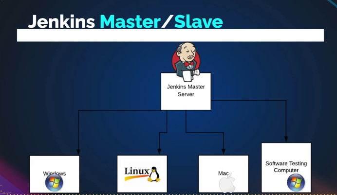

This section covers the Jenkins Master-Slave (or agent or node) concept. In the previous sections the jobs are run on Jenkins master server. But in some scenario or use cases where we need to run jobs from some other machines which will be the slave machines for Jenkins.

* [_Common use cases_](#common-use-cases)
* [_Prerequisites for Node setup_](#prerequisites-for-node-setup)
* [_Creating a Node server, user and directory_](#creating-a-node-server-user-and-directory)
* [_Adding the node to Jenkins_](#adding-the-node-to-jenkins)
    - [_Using password based authentication_](#using-password-based-authentication)
    - [_Using key based authentication_](#using-key-based-authentication)
* [_Using the Node_](#using-the-node)
    - [_Freestyle job to run on the node/agent_](#freestyle-job-to-run-on-the-nodeagent)
    - [_pipeline code to run on the node/agent_](#pipeline-code-to-run-on-the-nodeagent)

### Common use-cases
* load distribution or distributed builds
    > when using Jenkins at an organization level and there are many jobs getting triggered automatically, people are executing jobs which may not be possible for Jenkins to run all those jobs. So, if we add a node as a slave to Jenkins, then Jenkins can decide if the job has to be running on master or on the slave. Jenkins will pick up an available slave and execute the job on the slave. Whether we're executing or cloning the source code, we're running Maven commands, we're running software tests, these things will be running on the slave.

* cross-platform builds
    > If we're running Jenkins on a Linux machine and need to build a Windows-based package, we need some Windows tools like MS Build which we cannot execute that on Linux machines. So, we will add a Windows machine as a slave to Jenkins and we can run the specific job, say, "Run my Windows job only on this Windows machine." Or same for MacOS.

* Software testing
    > When doing continuous delivery and need to include the software testing. Software testers or the QA team will be writing software test cases. They will be mostly executing it from a Windows machine, so it'll open a browser graphically and execute the test cases. Software testers will have some machine which can be added as a slave, and we can run the software test cases from Jenkins. So we can include that job also in our pipeline.

* To run the scripts like shell script, Python script, Ansible playbook we can have a separate machine that runs the script by adding it as a slave to run any command or a script. It can be Windows machine or Linux machine or MacOS or someone's laptop.




### Prerequisites for Node setup
* Any OS
* Network access between Master and slave/node (Security group, firewall, etc)
* Java, JRE, JDK (as per requirement)
* User in the node which Jenkins will use to connect
* Directory with user ownership - Jenkins will use the user in node to connect with it and use the directory to create/access files
* Tools (installed on the node) required by the Jenkins job (eg: Maven, Ant, Git, etc) - Can be done using global configuration tool (eg: Ansible) or can login to node and install.

### Creating a Node server, user and directory
* In AWS, create an ec2 instance (Ubuntu 24, for this exercise) with a key pair (private key will be added in Jenkins)
    - Create Security group and add rules to allow ssh (port 22) from client IP (laptop/workstation) and Jenkins Master server SG

* Login (ssh) to the node server
```
ssh -i <path of the private key> ubuntu@<node public IP>
```
    > if ec2 is based on ubuntu then the username will be ubuntu. If connected through vpn, can use private IP to login

* Switch to root user
```
sudo -i
```

* The agent/node should have Java in order to add it to Jenkins. Run the below command to install Java (jdk 17 for this exercise, jdk 21 also works. If the Jenkins is setup with jdk 17 prefer to have the same version)
```
apt update && apt-install openjdk-17-jdk -y
```

* Add a user in the node
```
adduser devops
```
> provide a password and hit enter for other promptsWe can use either key-based login or password based login to the linux server. By default the passwrod based login is disabled

* To enable the passwrod based login
```
vim /etc/ssh/sshd_config
```
> uncomment the 'PasswordAuthenticaotion yes' and save the file. For most of the linux machines we can edit this file alone but from ubuntu 22 onwards there is a separate file apart from this which also need to be updated.

* If using ubuntu 22 or higher
```
vim /etc/ssh/sshd_config.d/60-cloudimg-settings.conf
```
> Set 'PasswordAuthentication' to yes and save

* Restart the ssh service
```
systemctl restart ssh
```
> In ubuntu the ssh service name is 'ssh' but for redhat or rpm based it is 'sshd'

> Now logout from the server and test the login using password

```
exit
```
```
ssh devops@<node IP>
```
> 'devops' is the user we created in earlier step

* Login to the node again using private key (devops user do not have root privilege) and switch to root user

* Create a folder
```
mkdir /opt/jenkins
```

* Add the ownership of this directory to the 'devops' user and 'ubuntu' group (ubuntu user is part of ubuntu group and have the root privilege). Both these users should be able to access this folder, else we get permission denied error
```
chown devops:ubuntu /opt/jenkins/
```
* Give full permission to the 'devops' user and 'ubuntu' group (ubuntu user) on this directory. Other users with no permission
```
chmod 770 /opt/jenkins/
```
* Validate the ownership and permissions
```
ls -ld /opt/jenkins/
```

### Adding the node to Jenkins

#### Using password based authentication
* In Jenkins dashboard --> manage jenkins --> Nodes --> click on `+ New node`
    - Give a name to node
    - tick the box for `permanent agent` under Type
    - create
        - Number of executers --> how many jobs can be run at a time
        - remote root directory (created in node server) --> /opt/jenkins
        - labels --> used to group the nodes or can use in the job to run on selected node
            > if there are multiple nodes with the same label (group of nodes) the job matching the node label will be run on any of the available node in the group
        - Usage (2 options)
            - use this node as much as possible
            - only build jobs with label expressions matching this node --> jobs with the same label will only be run on the node (for this exercise)
        - Launch method --> launch agents via ssh
            - Host --> add the private IP of the node server
            - Credentials
                - click on `Add` --> select Jenkins (credentials provider)
                - For `kind`, select `Username with password`
                - Scope --> Global
                - provide username and password of 'devops' user created in the node
                - Id --> giva a name to identify with node credentials (this name will be used in pipeline code)
                - add Description
                - click on `Add`
            - From the drop down select the saved token
            - Host key verification strategy --> select `Non verifying Verification strategy`
                > Jenkins tries to ssh node server and encounter 'Host key verfification failed'. This is becuase whenever we login to linux using ssh for the first time there would be a question (do you want to save the node) to enter yes/no. Jenkins will also face this question if the host key checking is enabled. To avoid this select 'Non verifying Verification strategy'
            - click on `Save`
    
* Now in Jenkins dashboard --> manage jenkins --> Nodes --> click on the newly added node --> log (can see the agent connection status)
* In the node --> 'ls -l /opt/jenkins/' --> can see a 'remoting' folder and 'remoting.jar' file (remoting agent configuration)

#### Using key based authentication
* To test the key based authentication for the same node, first disconnect the node added using passwrod authentication
    - Jenkins dashboard --> manage jenkins --> Nodes --> click on the newly added node --> Disconnect --> yes
    - In the node --> remove the contemt in the folder created for jenkins
    ```
    rm -rf /opt/jenkins/*
    ```
    > this will remove the remoting agent configuration

* Jenkins dashboard --> manage jenkins --> Nodes --> click on the node (added in previous section) --> configure
    - change the credentials
        - click on `Add` --> select Jenkins (credentials provider)
        - For `kind`, select `SSH Username with private key`
        - Scope --> Global
        - Id --> giva a name to identify with node credentials (this name will be used in pipeline code)
        - add Description
        - username --> 'ubuntu' ('devops' user do not have an ssh key)
        - private key --> tick 'enter directly' --> Add --> paste the private key content (including the begin and end statements)
        - click on `Add`
    - From the drop down select the saved token
    - click on `save`

* Now in Jenkins dashboard --> manage jenkins --> Nodes --> click on the newly added node --> log (can see the agent connection status)

### Using the Node

#### Freestyle job to run on the node/agent
* Jenkins Dashboard --> click on '+ New Item' --> give a name and select item type as 'freestyle project' (for practice) --> ok --> 
    - under **General** --> tick the box for `Restrict where this project can be run` (available for freestyle) --> for Label expression, give the label used for node/agent
    - Under **source code management** --> select Git --> Repository URL (https://github.com/hkhcoder/vprofile-project) and branch as 'atom' (for this exercise)
    - Under **Build steps** --> Add build step --> select `Invoke top-level Maven targets`
        - Maven version --> choose the maven tool (eg: maven3.9) installed in Jenkins --> manage jenkins --> Tools
            > we can select 'default' if maven is installed in the node. (In both cases, JDK should have been installed in the node for the maven to work). If the Maven is not installed in the node and we select default for maven version then the job fails as it will be running on the node/agent which do not have maven and the 'mvn install' command as per the build steps will fail.
        - Goals --> install
        > Build steps configured above will run the 'mvn install' command
    - click on `Save`
    - `Build now` --> to run the job


#### Pipeline code to run on the node/agent
* Pipeline code using the agent/node label [_sample Jenkinsfile_](Jenkinsfile), update the values before using this file.

* In Jenkins --> `+ New Item` --> Give a name and select item type as `pipeline` and click ok
    - Under Pipeline --> Definition --> Pipeline script --> paste the pipeline script
    - save --> build now


> In a big organaization where the Jenkins is been used a centralized tool, we can disable the execution on the Jenkins itself (Master). Jenkins will select the node randomly or based on the label.
Jenkins dashboard --> manage jenkins --> system --> usage --> select `only build jobs with label expressions matching this node`. Now the job will not run on the master but will try to find available node or try to match the label.

> Jenkins dashboard --> manage jenkins --> clouds (Add, remove and configure cloud instances to provision agents on-demand). To launch EC2 instances or Docker container on demand and execute jobs and then kill them or delete them.