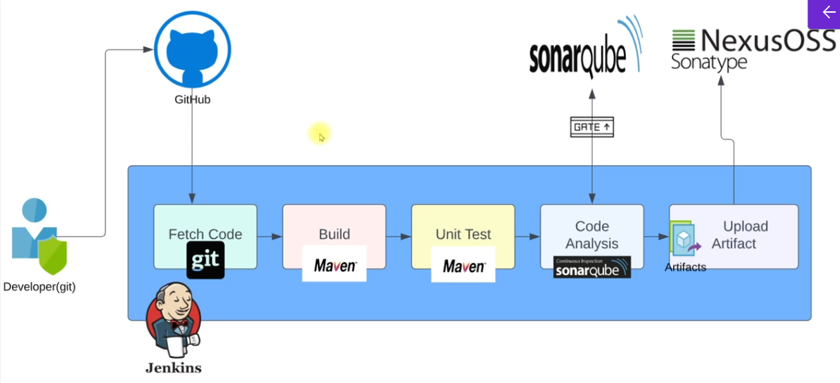

In [_PaaC-intro md file_](PaaC-intro.md) the stages of fetching code, testing and build is covered. The next step is code analysis () which is to check below aspects to improve the code quality
- the code against the best practices
- vulnerabilites (like top 10 OWASP - Open Worldwide Application Security Project)
- functional errors (bugs) before deployment
- etc..

* Some tools for code analysis -- Checkstyle, Cobertura, mstest, owasp, SonarQube Scanner, etc. For this practice we'd be using Checkstyle and SonarQube

* To write pipeline as code and integrate code analysis in it we need to first integrate the SonarQube server with jenkins. Also, we need to install SonarQube scanner tool in jenkins

### Integrating Sonar Qube with Jenkins
* Make sure the Jenkins and SonarQube servers are up and running
* Login to Jenkins and SonarQube (in browser -- refer [_CI-pipeline-flow md file_](CI-pipeline-flow.md))
* Jenkins Dashboard --> manage jenkins --> Tools --> Scroll down to find **SonarQube Scanner Installations** --> Click 'Add SonarQube Scanner'
    - Give a name (this name will be used in pipeline code)
    - version --> 6.2.1.4610 (for vprofile)
    - Save
* The SonarQube Scanner will scan the code and then we need to upload the results to SonarQube server. For this we need to store the SonarQube server details in Jenkins.
    - Jenkins Dashboard --> manage --> system --> Scroll down to find **SonarQube servers** --> tick 'Envriornment variables' and click 'Add SonarQube' under SonarQube installations
        1. Give a name (to identify the SonarQube server)
        2. URL (for this practice we use private IP of SonrQube server but in real time it can be a DNS name)
        > eg: http://privateIP:port
            
        >For this practice, nginx runs on SonarQube server which listens on port 80 (default port of http) and redirects to SonarQube on port 9000
        3. Server Authentication Token
            - Get the autehntication token from SonarQube service --> MyAccount --> security --> generate a token and copy it
            - Now click on 'Add' --> select Jenkins (credentials provider)
                * Under 'Kind' select 'Secret text'
                * store the token in 'Secret'
                * For Id, give a name to identify it as SonarQube token
                * add a description
                * Click on Add to save the token
            - From the drop down select the saved token
        4. Save
    - Make sure the SonarQube server SG has a rule to allow port 80 from Jenkins server SG

#### Pipeline with checkstyle code analysis
* Pipeline code with checkstyle code analysis [_Jenkinsfile with checkstyle code analysis_](Jenkinsfile-with-checkstyle-codeAnalysis)

    * In Jenkins --> '+ New Item' --> Give a name and select item type as 'pipeline' and click ok
        - Under Pipeline --> Definition --> paste the pipeline script
        - save --> build now
        - Build history -->  click on the success(/failed) button beside the job number (eg: #1) for job details. It will open console output.
            * Change to worksapces --> click on the path --> 'target' --> can see the 'checkstyle-result.xml' output of code analysis
            > xml format not easy to read so we send this result to sonar dashboard to get the report analysis

#### Pipeline with SonarQube code analysis
* Documentation to use SonarQube plugin --> https://www.jenkins.io/doc/pipeline/steps/sonar/
> As we install sonar tool in jenkins, we can also use the SonarQube documentation to use the plugin in pileine (https://docs.sonarsource.com/sonarqube-server/9.8/analyzing-source-code/scanners/jenkins-extension-sonarqube)

* Pipeline code with SonarQube code analysis [_Jenkinsfile with SonarQube code analysis_](Jenkinsfile-with-sonarQube-codeAnalysis)

    * In Jenkins --> '+ New Item' --> Give a name and select item type as 'pipeline' and click ok
        - Under Pipeline --> Definition --> paste the pipeline script
        - save --> build now
        - Build history -->  click on the success(/failed) button beside the job number (eg: #1) for job details. It will open console output --> scroll down, can see Analysis successful and the SonarQube url to find the results
    * In SonarQube --> projects --> can see the project (vprofile -- project name given in the sonar scanner stage for this practice) --> click on the project to see the results
        - SonarQube uses default Quality gates to analyse the code, we can add custom Quality gates
        - In SonarQube --> Quality Gates --> create --> give a name and save --> by default the lock is applied on conditions in the saved QG --> click unlock editing --> click add conditions, to add more
        - To make sure the project uses the custom QG --> projects --> click on the project --> Project Settings --> Quality Gate --> Change from using default QG to a specific one and select the custom QG --> save

#### Pipeline with Quality Gate
* Once the custom quality gate is selected, SonarQube will contact Jenkins using webhook and send the result through it. We need to create a webhook for this.
    - In SonarQube --> projects --> click on the project --> Project Settings --> webhooks --> Create
        - Name --> for webhook
        - URL --> http>//<privateIP of jenkins server>:8080/sonarqube-webhook

* To use the custom qulaity gate, we need to add another stage for it in pipeline

