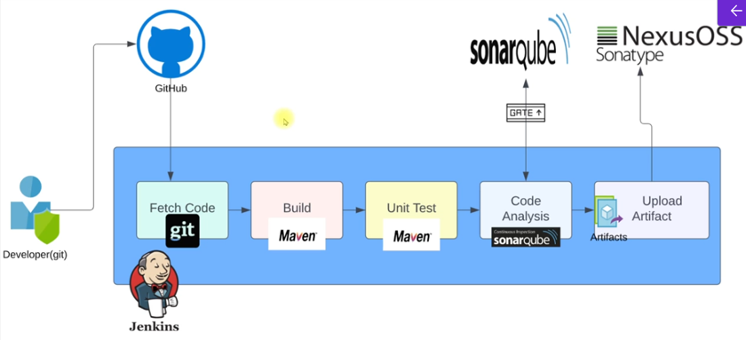

# Pipeline as a code
This file covers
- [sample pipeline with fetching coed, test and build stages](#sample-pipeline-with-fetching-code-test-and-build) 
- [pipeline with code analysis and Quality gates](#pipeline-with-code-analysis-and-quality-gates)
    - [Integrating Sonar Qube with Jenkins](#integrating-sonar-qube-with-jenkins)
        - [_Pipeline with checkstyle code analysis_](#pipeline-with-checkstyle-code-analysis)
        - [_Pipeline with SonarQube code analysis_](#pipeline-with-sonarqube-code-analysis)
    - [Pipeline with Quality Gate](#pipeline-with-quality-gate)
- [pipeline with Nexus](#pipeline-with-nexus)

## Sample pipeline with fetching code, test and Build
* To automate the pipeline setup with a file called --> 'Jenkinsfile'
    

[_sample-file_](Jenkinsfile)
> doc: https://www.jenkins.io/doc/book/pipeline/

* In Jenkins --> '+ New Item' --> Give a name and select item type as 'pipeline' and click ok
    - has 3 sections
        1. General
        2. Advanced Project options
        3. Pipeline
            - Under Pipeline --> Definition --> 2 options
                1. pipeline script (paste the pipeline script)
                2. pipeline script from scm (fetch the file from a given path in repo)
            - Save --> Build now

* Once the pipeline job is completed, can view the output --> build history --> click on the success/failed button beside the job number (eg: #1).

* To view the individual stage --> click on 'stages' --> click on any stage to see the respective stage status/output

## pipeline with code analysis and Quality gates
The next step is code analysis () which is to check below aspects to improve the code quality
- the code against the best practices
- vulnerabilites (like top 10 OWASP - Open Worldwide Application Security Project)
- functional errors (bugs) before deployment
- etc..

* Some tools for code analysis -- Checkstyle, Cobertura, mstest, owasp, SonarQube Scanner, etc. For this practice we'd be using Checkstyle and SonarQube

* To write pipeline as code and integrate code analysis in it we need to first integrate the SonarQube server with jenkins. Also, we need to install SonarQube scanner tool in jenkins

### Integrating Sonar Qube with Jenkins
* Make sure the Jenkins and SonarQube servers are up and running
* Login to Jenkins and SonarQube (in browser -- refer [_Jenkins and sonar qube setup in CI-pipeline-flow md file_](CI-pipeline-flow.md))
* Jenkins Dashboard --> manage jenkins --> Tools --> Scroll down to find **SonarQube Scanner Installations** --> Click 'Add SonarQube Scanner'
    - Give a name (this name will be used in pipeline code)
    - version --> 6.2.1.4610 (for vprofile)
    - Save
* The SonarQube Scanner will scan the code and then we need to upload the results to SonarQube server. For this we need to store the SonarQube server details in Jenkins.
    - Jenkins Dashboard --> manage --> system --> Scroll down to find **SonarQube servers** --> tick 'Envriornment variables' and click 'Add SonarQube' under SonarQube installations
        1. Give a name (to identify the SonarQube server)
        2. URL (for this practice we use private IP of SonrQube server but in real time it can be a DNS name)
        > eg: http://privateIP:port
            
        >For this practice, nginx runs on SonarQube server which listens on port 80 (default port of http) and redirects to SonarQube on port 9000
        3. Server Authentication Token
            - Get the autehntication token from SonarQube service --> MyAccount --> security --> generate a token and copy it
            - Now click on 'Add' --> select Jenkins (credentials provider)
                * Under 'Kind' select 'Secret text'
                * store the token in 'Secret'
                * For Id, give a name to identify it as SonarQube token
                * add a description
                * Click on Add to save the token
            - From the drop down select the saved token
        4. Save
    - Make sure the SonarQube server SG has a rule to allow port 80 from Jenkins server SG

#### Pipeline with checkstyle code analysis
* Pipeline code with checkstyle code analysis [_Jenkinsfile with checkstyle code analysis_](Jenkinsfile-with-checkstyle-codeAnalysis)

    * In Jenkins --> '+ New Item' --> Give a name and select item type as 'pipeline' and click ok
        - Under Pipeline --> Definition --> paste the pipeline script
        - save --> build now
        - Build history -->  click on the success(/failed) button beside the job number (eg: #1) for job details. It will open console output.
            * Change to worksapces --> click on the path --> 'target' --> can see the 'checkstyle-result.xml' output of code analysis
            > xml format not easy to read so we send this result to sonar dashboard to get the report analysis

#### Pipeline with SonarQube code analysis
* Documentation to use SonarQube plugin --> https://www.jenkins.io/doc/pipeline/steps/sonar/
> As we install sonar tool in jenkins, we can also use the SonarQube documentation to use the plugin in pileine (https://docs.sonarsource.com/sonarqube-server/9.8/analyzing-source-code/scanners/jenkins-extension-sonarqube)

* Pipeline code with SonarQube code analysis [_Jenkinsfile with SonarQube code analysis_](Jenkinsfile-with-sonarQube-codeAnalysis)

    * In Jenkins --> '+ New Item' --> Give a name and select item type as 'pipeline' and click ok
        - Under Pipeline --> Definition --> paste the pipeline script
        - save --> build now
        - Build history -->  click on the success(/failed) button beside the job number (eg: #1) for job details. It will open console output --> scroll down, can see Analysis successful and the SonarQube url to find the results
    * In SonarQube --> projects --> can see the project (vprofile -- project name given in the sonar scanner stage for this practice) --> click on the project to see the results
        - SonarQube uses default Quality gates to analyse the code, we can add custom Quality gates
        - In SonarQube --> Quality Gates --> create --> give a name and save --> by default the lock is applied on conditions in the saved QG --> click unlock editing --> click add conditions, to add more
        - To make sure the project uses the custom QG --> projects --> click on the project --> Project Settings --> Quality Gate --> Change from using default QG to a specific one and select the custom QG --> save

### Pipeline with Quality Gate
* Once the custom quality gate is selected, SonarQube will contact Jenkins using webhook and send the result through it. We need to create a webhook for this.
    - In SonarQube --> projects --> click on the project --> Project Settings --> webhooks --> Create
        - Name --> for webhook
        - URL --> http>//(privateIP of jenkins server):8080/sonarqube-webhook
        - create

* To use the custom qulaity gate, we need to add another stage for it in pipeline [_Jenkinsfile with SonarQube code analysis and Quality gate_](Jenkinsfile-with-sonarQube-codeAnalysis-qualityGate)
    - In Jenkins --> update the pipeline code in the same pipeline used for SonarQube code analysis above
        - Go to the pipeline used for SonarQube code analysis --> configure --> update the script (Under Pipeline --> Definition --> paste the pipeline script)
        > before saving this, make sure the jenkins server SG has a rule to allow port 8080 from SonarQube SG
        - save --> build now
        - after the job is completed, if the quality gate satge fails due to quality gate error the project in the SonarQube will also show as Failed

## pipeline with Nexus
The next step is to upload the artifacts to Nexus repository. We'd also use it to version the artifacts in case of multiple artifacts. Once the artifact is stored in the repository the OPs team or a script can fetch the artifact and deploy it to the server

> Nexus sonatype is a software repository to store and retrieve softwares. Also these repositories are used to download dependencies like when we run Mvn install it downloads dependencies from the internet.
But you can point maven to download dependencies from your own repository like Nexus repository.
But in this example we will see how to store our artifact to the repository.
There are different kinds of repositories like Maven to store Maven dependencies, apt to store Debian packages, or yum packages for RPMs (redhat based systems), NuGet package manager for dotnet, npm package manager for JavaScript (Node.js), Docker to store and retrieve Docker images.

### Setting up Nexus repository
* Make sure the Nexus server is up and running. Access the service using its IP on port 8081 (refer [_Nexus set up in CI-pipeline-flow md file_](CI-pipeline-flow.md))
    - Settings --> Repositories (there will be some default repositories) --> click on `create repository`