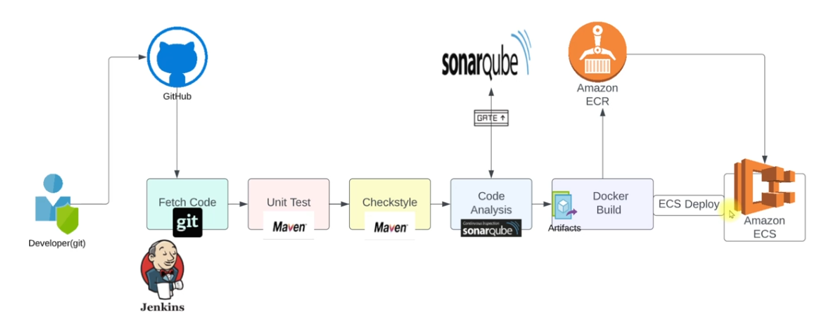

This file contains the steps for docker CI and CD
* [_Docker CI flow image_](#docker-ci-flow)
* [_Prerequisites for docker PaaC_](#prerequisites-for-docker-paac)
* [_Steps for docker CI in Jenkins_](#steps-for-docker-ci-in-jenkins)
    - [_Installing docker engine and aws cli in jenkins server_](#install-docker-engine-and-aws-cli)
    - [_Creating IAM user and ECR in AWS_](#creating-iam-user-and-ecr-in-aws)
    - [_Installing plugins and storing credentials in jenkins_](#install-the-plugins-and-store-credentials-in-jenkins)
* [_Pipeline for docker CI_](#pipeline-for-docker-ci)
* [_Pipeline for docker CI and CD_](#pipeline-for-docker-cicd)
    - [_docker CI and CD flow_](#docker-cicd-flow)
    - [_Prerequisited for docker CICD_](#prerequisites-for-docker-cicd)
    - [_Creating ECS cluster and service in AWS_](#creating-ecs-cluster-and-ecs-service-in-aws)
    - [_Pipeline with docker CICD_](#pipeline-with-docker-cicd)

## Docker CI flow


## Prerequisites for docker PaaC
* AWS
    - IAM user with Access keys
    - ECR (container registry)
* Plugins
    - ecr
    - docker
    - docker pipeline
    > docker plugins are used to run the docker commands

* Jenkins
    - store aws access keys (credentials)
    - Install docker engine in jenkins
        - Add jenkins user to docker group and reeboot --> jenkins user will execute docker commands and should have that privilege
        > To run the docker commands we need the docker engine

### Steps for docker CI in Jenkins
* Install docker engine in jenkins
    - Add jenkins user to docker group and reboot --> jenkins user will execute docker commands and should have that privilege
* Install AWS CLI --> required for CD to deploy the docker image (artifact)
* Create IAM user in AWS to use access and secret keys
* Create ECR (container registry)
* Plugins
    - ecr
    - docker pipeline
    - aws SDK for credentials
        > when we install ecr plugin it will also install aws sdk but if doesn't then we need to install it. This will be used to save the access and secret keys in jenkins
* Store the AWS credentials (Access and secret keys of IAM user) in Jenkins
* Run the pipeline

#### Install docker engine and aws CLI
* ssh to Jenkins server (since we used ubuntu for jenkins, username would be ubuntu in aws ec2)
```
ssh -i <key path> ubuntu@<jenkins server ip>
```
```
sudo apt update
```
* Install AWS-CLI
```
sudo snap install aws-cli --classic
```
* switch to root user
```
sudo -i
```
* Install docker engine (https://docs.docker.com/engine/install/ubuntu/#install-using-the-repository)

```
# Add Docker's official GPG key:
sudo apt-get update
sudo apt-get install ca-certificates curl
sudo install -m 0755 -d /etc/apt/keyrings
sudo curl -fsSL https://download.docker.com/linux/ubuntu/gpg -o /etc/apt/keyrings/docker.asc
sudo chmod a+r /etc/apt/keyrings/docker.asc

# Add the repository to Apt sources:
echo \
  "deb [arch=$(dpkg --print-architecture) signed-by=/etc/apt/keyrings/docker.asc] https://download.docker.com/linux/ubuntu \
  $(. /etc/os-release && echo "${UBUNTU_CODENAME:-$VERSION_CODENAME}") stable" | \
  sudo tee /etc/apt/sources.list.d/docker.list > /dev/null
sudo apt-get update
```
```
sudo apt-get install docker-ce docker-ce-cli containerd.io docker-buildx-plugin docker-compose-plugin -y
```
> Check the status
```
systemctl status docker
```
* Now add jenkins user to docker group (when docker is installed it also create docker group)
```
usermod -a -G docker jenkins
```
> to check if it is added
```
id jenkins
```
* Reboot the jenkins server to load the configurations and changes
```
reboot
```

#### Creating IAM user and ECR in AWS
* In AWS --> IAM --> users --> click on `create user`
    - give a name like 'jenkins' --> Next
    - permission options --> select `Attach policy directly`
        - permission policies --> Add the policies `AmazonEC2ContainerRegistryFullAccess` and `AmazonECS_FullAccess`
        - Next
        > This user used by jenkins require access to ECR to upload the docker image and also to ECS (container service) to deploy the image in CD pipeline
    - Create user
    - Select the created user --> security credentials --> create access key --> for use case select 'CLI' --> tick the confirmation box and click on 'Next' --> click on `create access key`
        > Copy the access and secret keys or donwload the csv file

* In AWS --> ECR --> create --> give a name and click on `create`

#### Install the plugins and store credentials in jenkins
* To install the plugins
    -   In Jenkins Dashboard --> manage jenkins --> plugins --> available plugins
        - search for 'aws' --> select `Amazon Web Services SDK::All`
        - search for 'ecr' --> select `Amazon ECR`
        - search for 'docker' --> select `Docker Pipeline` and `CloudBees Docker Build and Publish`
        - click on `Install`

* To store the credentials for AWS
    - Jenkins Dashboard --> manage jenkins --> credentials --> under `stores scoped to jenkins` click on `system` --> Global credentials (unrestriced) --> click on `Add credentials`
        - For `kind`, select `AWS Credentials` (this option is visible after installing the AWS SDK plugin)
        - Scope --> Global
        - Id --> giva a name to identify with AWS credentials (this name will be used in pipeline code)
        - add Description
        - Access key ID --> copy the access key ID from the CSV
        - Secret Access key --> copy the secret access key from the CSV
        - click on `create`


### Pipeline for Docker CI
* update the values in [_Jenkinsfile for docker CI_](Jenkinsfile-for-docker-CI)

* In Jenkins --> `+ New Item` --> Give a name and select item type as `pipeline` and click ok
    - Under Pipeline --> Definition --> Pipeline script --> paste the pipeline script
    - save --> build now

    > Once the job is completed, can see the image in ECR.
    > The image is uploaded to ECR but also exist in Jenkins, so we need to another stage to remove the image from Jenkins after the upload to ECR is completed (covered in the pipeline code)

### Pipeline for Docker CICD
#### Docker CICD flow


* It is an extension of CI pipeline to also include the delivery of code (deployment) to the Container hosting platform
    - Docker engine (local development / testing -- install docker engine and run containers using docker commands, No HA, self-healing, etc. required to run in Stage and prod environment)
    - Kubernetes
    - ECS (Elastic Container Service - for this exercise)

#### Prerequisites for docker CICD:
    - ECS cluster and service
    - Plugin --> pipeline: aws steps

#### Creating ECS cluster and ECS service in AWS
* In AWS --> search for ECS
    - click on `Clusters` --> click on 'create cluster'
        - give a name
        - under Networking --> vpc and subnets (of all zones available in the region are selected), leave the default selection or choose a custom vpc and subnets
        - under Infrastructure --> AWS fargate (serverless) - default
            > can also use ec2 instances
        - Monitoring --> enable container insights (metrics are collected to CloudWatch)
        - tags --> add the tags related to the project
        - click on `create`
            > If any error after clicking on create, repeat the creation steps again.

    > Once the ECS cluster creation is completed, create Task definition which wll have the informtion about the container like from where the images are pulled, cpu, RAM, etc.

    - click on `Task definitions` --> click on 'create new task definition'
        - Give a name
        - under  Infrastructure
            - launch type --> AWS fargate (default selection)
            - OS --> linux/x86_64
            - 1 CPU and 2GB Memory (minimum for this exercise)
            - Task roles (IAM roles/policies the ECS will use to access other AWS resources - like to fetch the image from ECR, to access CloudWatch logs where the container logs are stored)
                - Task role --> leave as empty
                - Task execution role --> `Create new role` --> this will create a new IAM role for which more permissions can be added
        - under 'Container - 1'
            - give a name to container to be created
            - Image URI --> ECR URI (eg: 716657688884.dkr.ecr.us-east-1.amazonaws.com/vprofileappimg)
            - container port --> 8080 (for tomcat service that runs the vproapp in this exercise)
            - By default 'use log collection' is ticked --> logs will be stored in CloudWatch
                > By default the IAM role created (Task execution role) will not have the permission to access these logs. After creating the Task definition this IAM role needs to be updated.
            - Leave others as default
        - Add tags (if required)
        - click on `create`
        > By using this Task definition we can run the container on the ECS cluster

    - After the Task definition is created --> click on it --> click on `csTaskExecutionRole` (can also go from IAM roles).
        - Add permissions --> Attach policies --> search for and select `CloudWatchLogsFullAccess` --> click on `Add permissions`

    - Now go to the ECS cluster --> under `services` --> click 'create'
        > In ECS, we can also use 'Task' which is running the container but here the container management is manual. If we use 'Service' it will manage the task. 
        
        - Under 'Environment'
            - compute options --> capacity provider startegy --> capacity provider --> Fargate
        - Under 'Deployment'
            - Application type --> service
            - Family --> select the Task definition created in previous step and Revision (latest or any specific in case of multiple revisions)
            - Give a name to service
            - Desired tasks --> 1 (container for this exercise)
            - Deployment options --> in case of multiple containers/tasks, we can use this to select the deployment type, min and max running tasks at the time of deployment
            - Deployment failure detection --> uncheck the selection (for this exercise to avoid any issues)
        - Under 'Networking'
            - By default it will be the same vpc and subnets of ECS
            - Security Groups 
                - create new
                    > this SG will be used for the container and the load balancer created part of the service
                - Add 2 rules (Inbound)
                    - http (port 80) and source as anywhere
                    - custom tcp (port 8080) and source as anywhere, cuz the LB direct the request to container (which run on 8080 for tomcat in this exercise)
        - under 'Load balancing'
            - type --> application load balancer
            - container --> select the container created under Task definition
                > It will show two ports (eg --> 8080:8080, 1st one is the backend port of LB and the other is the frontend port of the container)
            - give a name to LB
            - Listener
                - port 80 (frontend of LB)
                - give a name to Target group
        - click on `create`

        > To access the application --> service --> configuration and networking --> Network configuration --> DNS names (URL to access application). But the deployment here is done through AWS console, in the next section we see it through Jenkins which will tell the ECS service to update the container and delete the old container

> **Install the plugin required to run AWS CLI command for deployment stage** --> Jenkins Dashboard --> manage jenkins --> plugins --> available plugins --> search for and select `Pipeline: AWS Steps` --> click on `Install`

#### Pipeline with docker CICD
* Pipeline code with the stage to deploy the image to ECS [_Jenkinsfile for docker CICD_](Jenkinsfile-for-docker-CICD). Change the file name to Jenkinsfile and update the values in stages before using this.

* In Jenkins --> `+ New Item` --> Give a name and select item type as `pipeline` and click ok
        - Under Pipeline --> Definition --> Pipeline script --> paste the pipeline script
        - save --> build now

    > When we run this pipeline, it will create a new container with tha latest image and the old (running) container in ECS service will be deleted gradually once the new container becomes active.