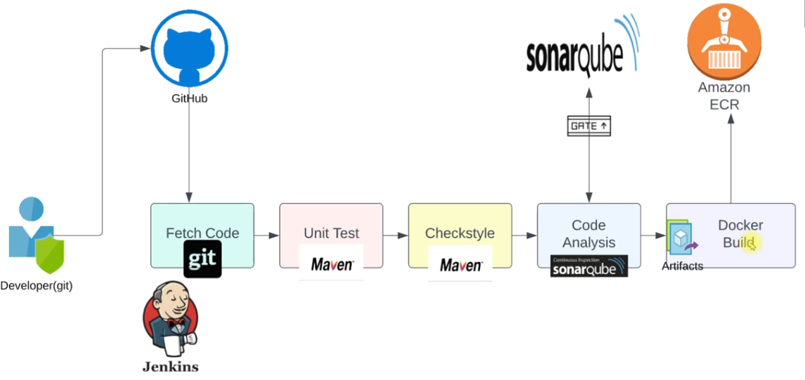

## Docker CI flow

## Prerequisites for docker PaaC
* AWS
    - IAM user with Access keys
    - ECR (container registry)
* Plugins
    - ecr
    - docker
    - docker pipeline
    > docker plugins are used to run the docker commands

* Jenkins
    - store aws access keys (credentials)
    - Install docker engine in jenkins
        - Add jenkins user to docker group and reeboot --> jenkins user will execute docker commands and should have that privilege
        > To run the docker commands we need the docker engine

### Steps for docker CI in Jenkins
* Install docker engine in jenkins
    - Add jenkins user to docker group and reboot --> jenkins user will execute docker commands and should have that privilege
* Install AWS CLI --> required for CD to deploy the docker image (artifact)
* Create IAM user in AWS to use access and secret keys
* Create ECR (container registry)
* Plugins
    - ecr
    - docker pipeline
    - aws SDK for credentials
* Store the AWS credentials (Access and secret keys of IAM user) in Jenkins
* Run the pipeline