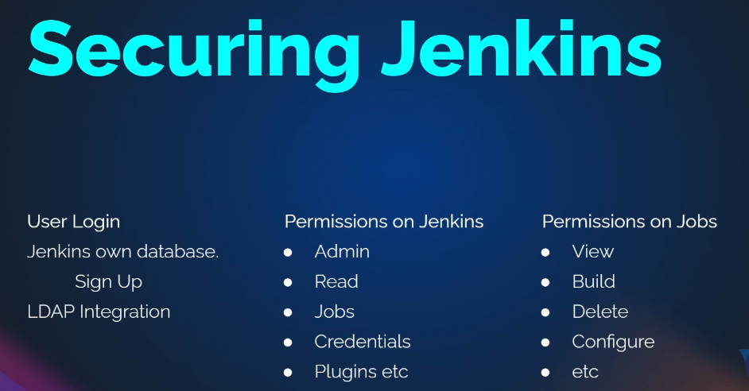
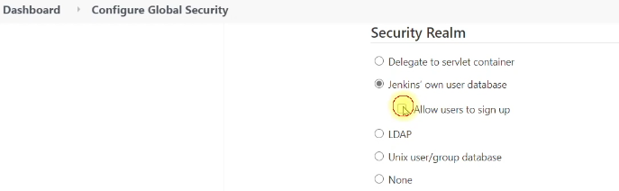
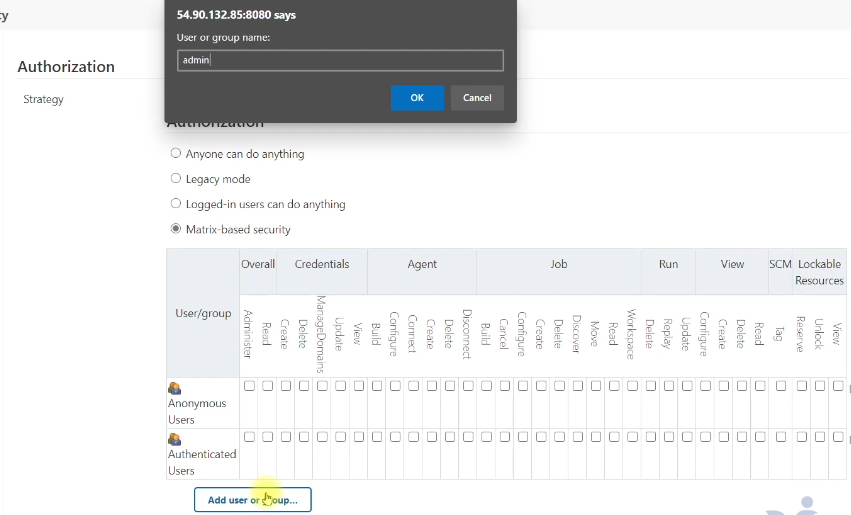
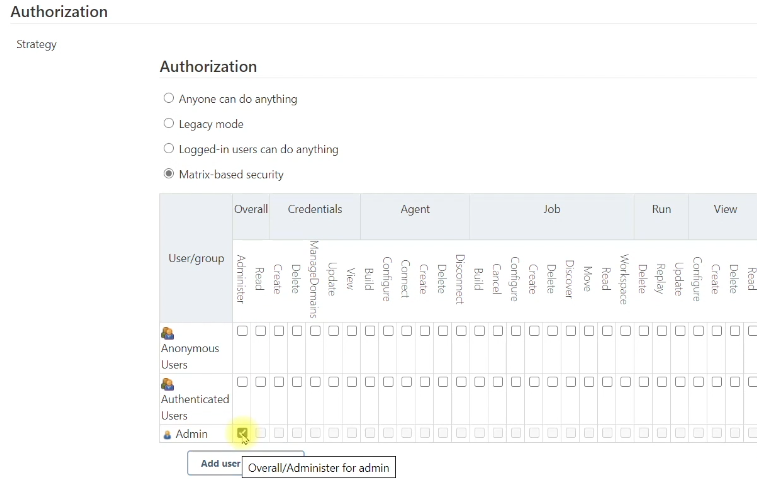

* This section covers the Authentication and Authorization in Jenkins. In the previous sections all configurations and jobs are done using Admin user.
* In Jenkins, once we create a pipeline it may be handed-over to the respective team (developers, testers, OPs or non-OPs). The teams cannot use Admin user, should use their IDs with the permissions set as per the requirement

* Manage Jenkins --> security --> configure Global security --> 

    - **Authentication** --> security realm
        

        1. Jenkin's own user database --> Allow users to sing up (Users with the Jenkins URL can sign up themself)
            - Once the user sign up, the Admin user have to provide permissions --> Manage Jenkins --> security --> configure Global security --> Authorization --> click `add user or group` --> give the user name (if the user is not part of Jenkin's database a cross 'x'mark wuill be shown for the user logo)
        2. LDAP --> to integrate users in AD

    - **Authorization**
        * Matrix-based security - permissions at Jenkins level
            - click `add user or group` as admin user --> 
            
             

        * Project-based matrix authorization strategy - permissions at project / job level
            - click `add user or group` as admin user --> 
            
            
            - As admin user, go to a job (where the user need access) --> configure --> 
                * Under General --> tick the box for `enable project-based security` --> click `add user or group`
                

